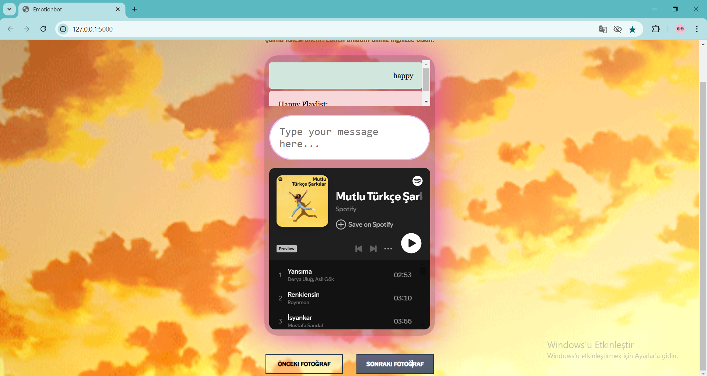
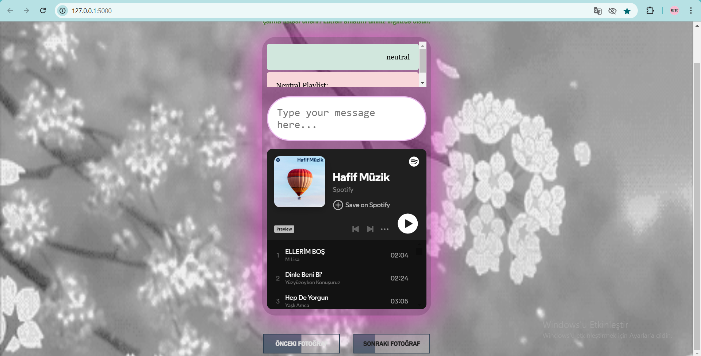
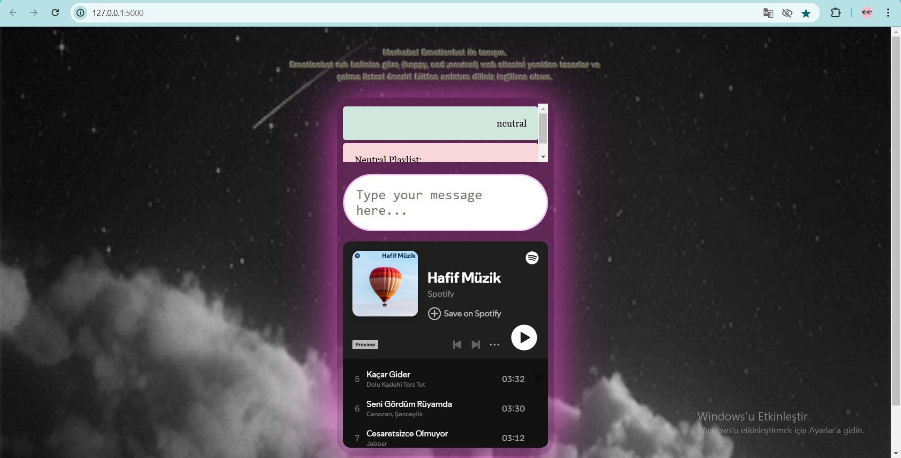

# Emotionbot 
Emotionbot, kullanıcıların duygu durumlarına göre web 
sitesinin tasarımını ve önerilen çalma listesini otomatik olarak 
değiştiren bir web uygulamasıdır. HTML, CSS, JavaScript ile 
oluşturulan ön yüz ve Python, Flask tabanlı arkayüz kullanılmıştır. 
Kullanıcılar, sohbet kutusuna mesaj yazarak duygularını ifade eder. 
Chatbot (textblob kütüphanesi) mesajları analiz ederek 'mutlu', 'üzgün' veya
'nötr' olarak sınıflandırır. Mutlu ruh hali için sarı renk, üzgün ruh hali için 
mavi renk, nötr ruh hali için gri renk ağırlıklı arka plan fotoğrafları kullanılmıştır. 
Her bir duygu için ise beş farklı arka plan fotoğrafı mevcuttur. Önceki Fotoğraf
ve Sonraki Fotoğraf butonları ile fotoğraflar arasında geçiş yapılabilir.
Spotify API’si ile entegre olan uygulama, her duygu durumuna uygun çalma listeleri
önerir ve arka plan rengini değiştirir. Emotionbot, kişiselleştirilmiş müzik ve 
görsellerle kullanıcı deneyimini zenginleştirir, duygusal rahatlama ve 
moral desteği sağlar.

(Projedeki EMOTIONBOT yazısında ve açıklama yazısında animasyon kullanıldı,
hover efektleri ile önceki fotoğraf,sonraki fotoğraf butonları oluşturuldu)


## Özellikler
- TextBlob kullanarak duygu analizi yapar
- Duyguya göre Spotify çalma listesi önerir ("Happy", "Sad", "Neutral").
- Kullanıcının ruh haline göre dinamik olarak web sayfası tasarımı değişir.
- Spotify playlist'lerini gömülü bir iframe aracılığıyla önerir. (Çalma listeleri sayfada gömülüdür)
- Minimal ve dinamik bir ön yüz tasarımı içerir.

## Kurulum ve Çalıştırma

### Gereksinimler
Python 3.x'in yüklü olduğundan emin olun. [Buradan](https://www.python.org/downloads/) indirebilirsiniz.

### 1. Depoyu Klonlayın:
   ```bash
   git clone https://github.com/kullaniciadi/emotionbot.git
   cd emotionbot
   ```

### 2. Gerekli Bağımlılıkları Yükleyin:
   ```bash
   pip install -r requirements.txt
   ```

### 3. Flask Sunucusunu Başlatın:
   ```bash
   python app.py
   ```

### 4. Uygulamayı Açın:
Tarayıcıdan [http://127.0.0.1:5000](http://127.0.0.1:5000) adresine gidin.

## Kullanılan Teknolojiler

- **Backend**: Python, Flask, TextBlob, Spotify API
- **Frontend**: HTML, CSS, JavaScript (dinamik UI/UX için)
- **Duygu Analizi**: TextBlob
- **Spotify API**: Ruh haline göre çalma listeleri getirilir
- **Veritabanı**: Yok (statik çalma listeleri)

## Spotify API Kurulumu
 1. Spotify Developer sitesinde bir Spotify geliştirici hesabı oluşturun.
 2. Yeni bir uygulama oluşturun ve Client ID ve Client Secret bilgilerinizi alın.
 3. Aşağıdaki kodları app.py dosyanızda kendi kimlik bilgilerinize göre değiştirin:

```python
 SPOTIFY_CLIENT_ID = 'your-client-id'
 SPOTIFY_CLIENT_SECRET = 'your-client-secret'
```
## Uygulamayı Çalıştırma
  1. Terminalde şu komutu çalıştırın
     ```bash
         python app.py
     ```
  2. Tarayıcınızda http://127.0.0.1:5000/ adresine gidin.

## Kullanımı
1. Mesajınızı yazın. Ruh halinize göre bot bir çalma listesi önerisi sunacaktır.
2. Web sayfasının teması, tespit edilen duyguya göre değişecektir (örneğin, mutlu için sarı, üzgün 
   için mavi, nötr için gri).
3. Spotify'dan doğrudan gömülü olarak gelen çalma listesinin tadını çıkarın.
 
## Proje Yapısı

```
/DUYGU DURUM WEB SITESI
├── app.py                # Ana Flask uygulama dosyası
├── requirements.txt      # Python bağımlılıkları
├── /templates            # Frontend için HTML dosyaları
│   └── index.html
├── /static               # Statik dosyalar (CSS, JavaScript, resimler)
│   ├── /css
│       └── style.css
│   ├── /js
│       └── script.js
│   └── /images
└── README.md
```

## Sunum









